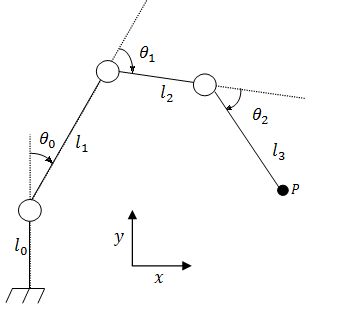

# Robot

In this problem, a robotic arm is modeled as a 2D joint of *4* bars *b*i of length *l*i, where every one of these bars *b*i can rotate relatively to the bar before *b*i-1 with an angle *θ*i. The first bar *l*0 is perpendicularly attached to the ground and cannot move. All these parameters are illustrated in the figure below.

A drilling tool is mounted at the end of the last bar of the robot, whose extremity is designated by the point P in the figure. We want the tool to reach a certain point q of coordinates x and y. Can you compute the values of *θ*i allowing p to reach q?

## Input Specification

The first line of the input contains one integer *T*, the number of test cases, followed by *T* test cases.

The first line of each test case contains 4 integers *l*i *(i∈0,1,2,3)* the lengths of the bars *(1≤l*i*≤3000* and *∑l*i*≤l*0*)*

The second line contains 3 numbers : *X ,Y* and *Z*. *X* and *Y* are denoting the position of the point *q*, and *Z* is described above (*Z* is given in degrees).

## Output Specification

For each test case output the corresponding angles in degrees. If there are many solutions, print any.

Your answer will be considered as correct if it has an absolute or relative error less than *10*−6.

## Sample Input

~~~
1
30 10 10 10
20 20 90
~~~

## Sample Output

~~~
180.00000000 -90.00000000 0.00000000
~~~

## Hint

This problem could be solved using [inverse kinematics for 3R Planar](https://www.seas.upenn.edu/~meam520/notes02/IntroRobotKinematics5.pdf) and [inverse kinematics for 2R Planar](https://robohub.org/masterclass-inverse-kinematics-and-robot-motion/)

## Source

MOI Arena's [Robot](http://arena.ioi.ma/problem/mcpc2018robot2)
