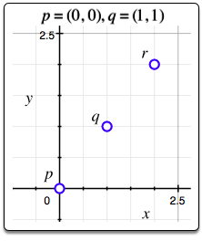
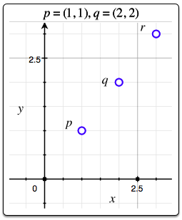

# Find the Point

Consider two points,`p = (px, py)`  and `q = (qx, qy)`. We consider the inversion or [point reflection](https://en.wikipedia.org/wiki/Point_reflection), `r = (rx, ry)`, of point `p` across point `q` to be a `180 deg` rotation of point `p` around `q`.

Given `n` sets of points `p` and `q`, find `r` for each pair of points and print two space-separated integers denoting the respective values of `rx` and `ry` on a new line.

## Function Description

Complete the findPoint function in the editor below.

findPoint has the following parameters:

- int px, py, qx, qy: x and y coordinates for points `p` and `q`
 
## Returns

- int[2]: x and y coordinates of the reflected point `r`

## Input Format

The first line contains an integer, `n`, denoting the number of sets of points.
Each of the `n` subsequent lines contains four space-separated integers that describe the respective values of `px`, `py`, `qx`, and `qy` defining points `p = (px, py)` and `q = (qx, qy)`.

## Constraints

## Sample Input

```
2
0 0 1 1
1 1 2 2
```

## Sample Output

```
2 2
3 3
```

## Explanation

The graphs below depict points `p`, `q`, and `r` for the `n = 2` points given as Sample Input:

1. 
2. 

## Source 

Hackerrank - [Find the Point](https://www.hackerrank.com/challenges/find-point/problem)
